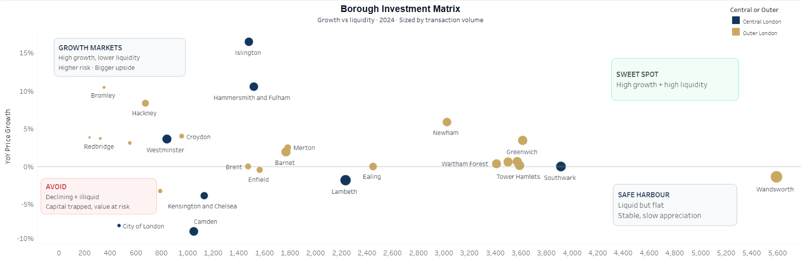

# London Property Investment Intelligence

> **Business question:** *Where in London should an investor deploy £500K over the next 12 months for the best risk-adjusted return?*

Acting as an analyst for a property investment desk, I analysed **285,791 HM Land Registry transactions (2021–2024, £280B in value)** to answer one decision: where to buy. The output is a 4-page Tableau dashboard that ranks boroughs on growth *and* liquidity, isolates the property types that actually appreciate, and surfaces specific postcodes trading below their borough's median.

---

## Executive summary

London as a whole looks flat — the **2024 median was £565K, down 0.88% year-on-year** — but that headline hides the entire opportunity. Underneath the flat average, **individual boroughs ranged from +16.5% to negative**, so the investment question isn't "is London up?" — it's "*which* London?"

Three findings drive the recommendation:

- **Growth is concentrated in a handful of boroughs.** Islington led at **+16.5% YoY**, followed by Hammersmith & Fulham **+10.6%** and Hackney **+8.4%** — while the London median was *negative*. Buying the index would have lost money; buying the right borough returned double digits.
- **Liquidity and growth rarely come together.** On a growth-vs-liquidity matrix, the highest-growth boroughs (Islington, H&F) sit in "Growth Markets" — strong upside but *thinner* trading volume, so harder to exit — while the most liquid boroughs (Wandsworth 5.6K sales, Lambeth 4.5K) are slow-growth "Safe Harbour." The investor has to choose which risk to take, consciously.
- **Property type matters as much as location.** Across London, **Terraced** homes were the most *consistently* appreciating type (almost every borough positive), while **Detached** swung wildly (+81% in one borough, −44% in another) on low volume — a trap for the unwary.

**Recommendation:** For **capital growth**, target Islington / Hammersmith & Fulham in *terraced* or *flat* stock, accepting lower liquidity. For a **liquidity-first** strategy, Wandsworth/Lambeth let you exit fast but expect flat appreciation. For **value entry**, 9 specific postcodes trade >25% below their borough median (detailed below) — though most are cheaper pockets of prime boroughs, not absolute bargains.

---

## Northstar metrics (2021–2024)

| Metric | Value |
|---|---|
| Total transaction value analysed | £280.2B |
| Transactions | 285,791 |
| 2024 median sale price | £565K |
| London YoY price change (2024 vs 2023) | −0.88% |
| Volume cycle | 85.1K (2021) → 59.6K (2023 trough) → 66.0K (2024 recovery) |

---

## Insights deep-dive

### 1. The market cycle: a rate-driven dip, then recovery

Transaction volume tells the 4-year story cleanly: **85.1K (2021) → 75.2K (2022) → 59.6K (2023) → 66.0K (2024)**. The 2023 trough (−20.8%) lines up exactly with the BoE base rate peaking around 5.25% ("mortgage rate freeze"); 2024 rebounded **+10.7%** as the market recovered. Prices, meanwhile, held broadly flat (median £565K, −0.88%) — so this was a *volume* shock, not a price crash. Context that frames everything below.

### 2. Growth is a borough story, not a London story

While London was −0.88%, the **top boroughs by 2024 YoY median growth** were:

| Borough | YoY growth | Median price |
|---|---|---|
| Islington | +16.5% | £731K |
| Hammersmith & Fulham | +10.6% | £815K |
| Hackney | +8.4% | £701K |
| Bexley | +3.9% | £383K |
| Westminster | +3.6% | £1,028K |

The spread between the best borough and the London average is ~17 points — which is the whole point: **the average is the wrong unit of analysis for an investor.**

### 3. Growth vs liquidity — you can't have both

Plotting YoY growth against transaction volume splits London into four quadrants:
- **Growth Markets (high growth, thinner liquidity):** Islington, Hammersmith & Fulham — biggest upside, but fewer buyers when you sell.
- **Safe Harbour (liquid, flat):** Wandsworth (5.6K sales), Lambeth (4.5K), Southwark (3.9K) — easy to exit, slow appreciation.
- **Avoid (declining + illiquid):** capital trapped.

This reframes the decision from "what's growing?" to "**what risk am I willing to hold — illiquidity or stagnation?**"

### 4. Property type: chase consistency, not the biggest number

4-year (2021→2024) growth by type across boroughs:
- **Terraced** — most *consistent* gains, positive in almost every borough (e.g. Bexley/Redbridge +11%). The reliable pick.
- **Flat** — broadly positive (Hounslow +14%), one notable negative (Bexley −12%).
- **Semi-detached** — solid, led by Hackney +26%.
- **Detached** — *highest variance*: +81% in Hammersmith & Fulham but −44% in Kensington & Chelsea. These are thin-volume segments where a few sales swing the number — **high risk of a misleading signal**, not a safe bet.

Also quantified: a steep **new-build premium** (e.g. Westminster existing £966K vs new-build £1,600K) and large **freehold-vs-leasehold premiums** in prime boroughs (City of London 469%, Westminster 283%, Camden 162%).

### 5. Hidden gems: 9 postcodes trading >25% below their borough median

Comparing each postcode's median to its parent borough's (2023–24, min. 30 transactions), the distribution was: 77 in line, 28 at significant premium, 24 undervalued (10–25%), 15 premium, and **9 "significantly undervalued" (>25% below):**

| Postcode | Borough | Postcode median | Borough median | Gap |
|---|---|---|---|---|
| SW1V | Westminster | £655K | £1,584K | −58.7% |
| W9 | Westminster | £680K | £1,584K | −57.1% |
| WC1H | Camden | £408K | £880K | −53.7% |
| NW8 | Westminster | £859K | £1,584K | −45.8% |
| WC2H | Westminster | £900K | £1,584K | −43.2% |
| W2 | Westminster | £950K | £1,584K | −40.0% |
| W10 | Kensington & Chelsea | £719K | £1,150K | −37.5% |
| SW1P | Westminster | £1,067K | £1,584K | −32.7% |
| NW5 | Camden | £658K | £880K | −25.3% |

**Honest read:** 7 of the 9 sit in Westminster or K&C, so these are *relative* value — cheaper pockets within ultra-prime boroughs, often reflecting more flats/leasehold stock — not absolute bargains. The genuinely interesting signal is the *gap*: a buyer wanting a Westminster/K&C address can enter 30–58% below the borough median in these districts, which is exactly the kind of micro-targeting the borough-level view would miss.

---

## Recommendations (tied to the numbers)

1. **Capital-growth strategy → Islington or Hammersmith & Fulham.** They returned +16.5% / +10.6% while London was −0.88%; accept the lower liquidity (they sit in the "Growth Markets" quadrant) as the price of that upside.
2. **Liquidity-first strategy → Wandsworth or Lambeth.** 5.6K / 4.5K annual sales means a fast exit, but model flat appreciation, not growth.
3. **Pick the property type deliberately → favour Terraced (and selectively Flats).** They appreciated consistently; treat headline Detached numbers (+81%) with suspicion because they ride on tiny transaction counts.
4. **For value entry → screen the 9 sub-median postcodes**, but underwrite each individually — confirm the discount reflects stock mix (flats/leasehold) rather than a structural problem before deploying capital.

---

## How the analysis was built *(technical appendix)*

Pipeline, data model, and engineering detail (click to expand)

**Stack:** Python → AWS S3 → Snowflake → dbt → Tableau.

- **Ingestion:** filtered HM Land Registry's England & Wales Price Paid Data (~600MB, ~2.4M rows) to **285,791 London transactions** via a memory-safe chunked pandas pipeline; landed raw CSV (bronze) and Parquet (silver) in S3, loaded to Snowflake.
- **Transformation (dbt, 4-layer medallion):** staging (typing, decoding property/tenure codes, deriving postcode districts) → intermediate (borough enrichment, price bands, analytical flags) → **marts: a Kimball star schema** (`fact_transactions` 285,791 rows + `dim_date`, `dim_location`, `dim_property`, MD5 surrogate keys) → **8 KPI views**, one per business question (`v_borough_yoy_growth`, `v_undervalued_postcodes`, etc.).
- **Quality:** **70+ automated dbt tests** (unique, not_null, accepted_values, relationships enforcing zero orphaned fact rows). Window functions (`LAG`, `RANK`, `NTILE`) isolated to the KPI layer; minimum 30–50 transaction thresholds on aggregations to avoid misleading single-sale stats.
- **Full methodology:** [`docs/methodology.md`](docs/methodology.md). **Code/SQL:** `/dbt_london_housing`. **Dashboard:** `dashboard/London_Housing_Analytics.twbx`.

**Caveats:** nominal prices (no inflation adjustment); postcode→borough mapping covers ~95% of transactions; 2024 under-counts slightly due to ~2-month registration lag; sale-price only (no rental-yield/leverage data).

---

**Irfan Arif** — Data Analyst · MSc FinTech, BSc Computer Science
[Live Tableau dashboard](https://public.tableau.com/app/profile/irfan.arif1826/viz/London_Housing_Analytics/Executive_Overview) · [LinkedIn](https://linkedin.com/in/irfanarif7) · [GitHub](https://github.com/IrfanArif61)
