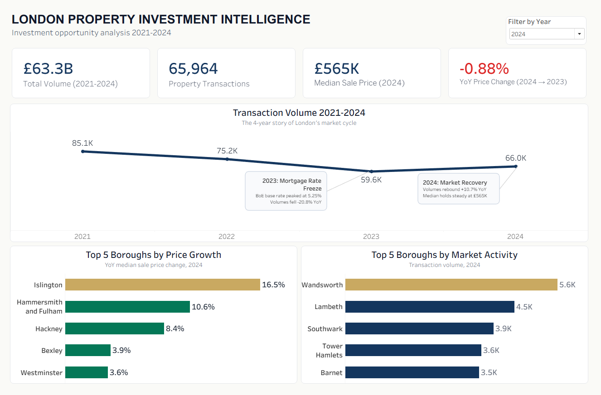
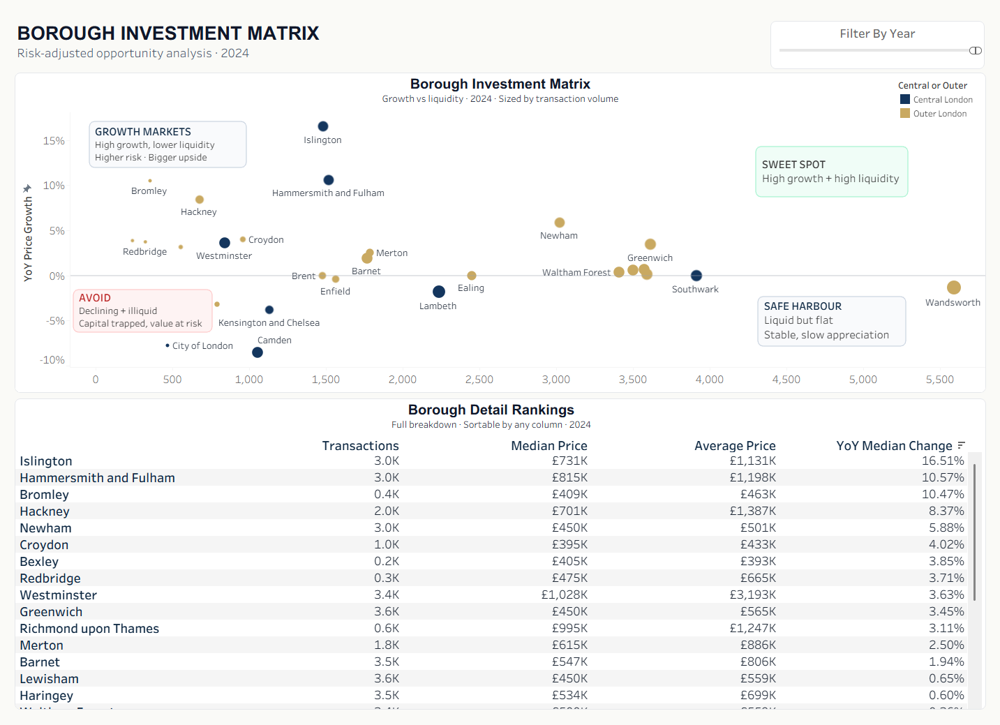
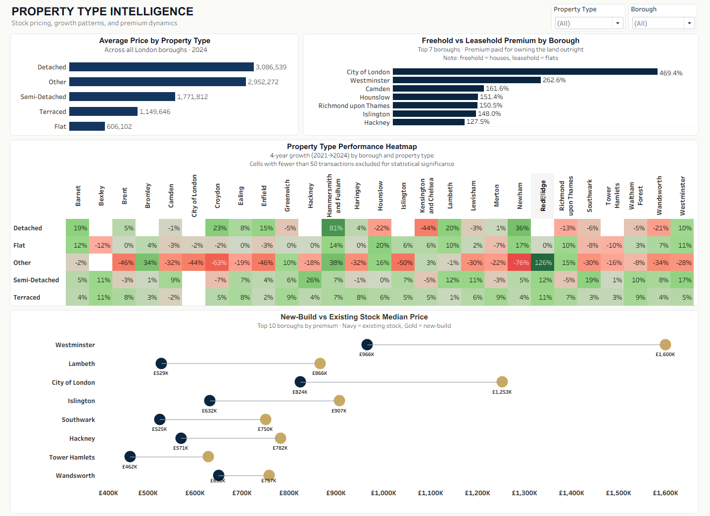
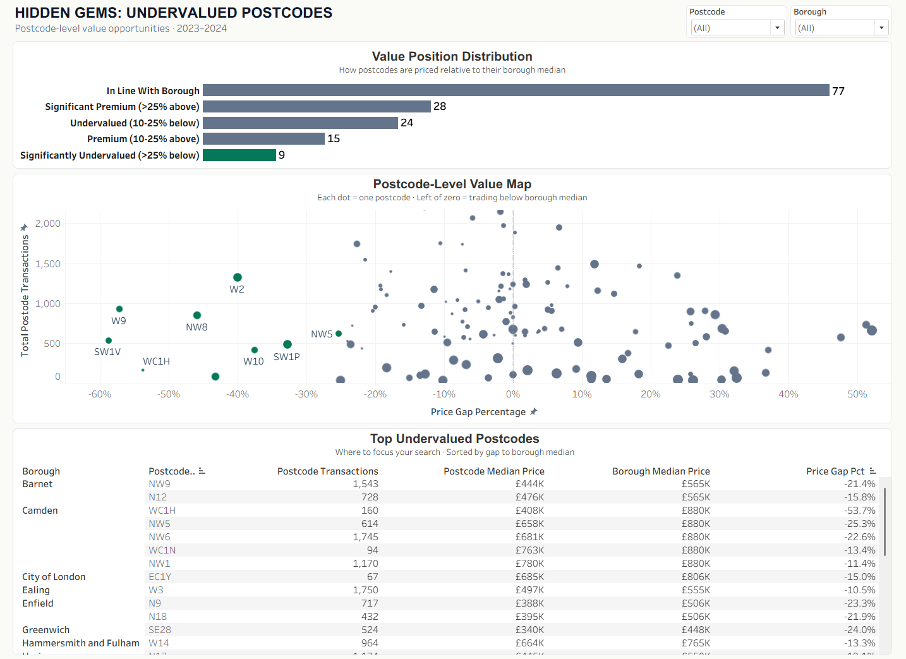
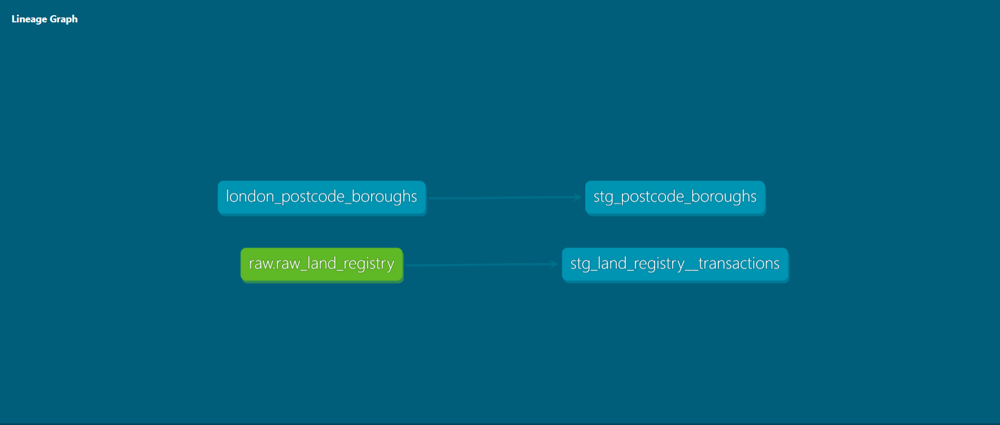
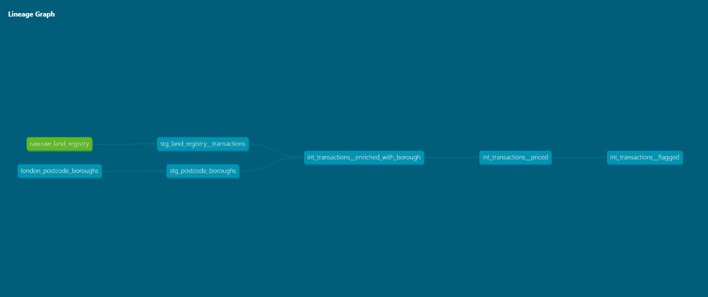
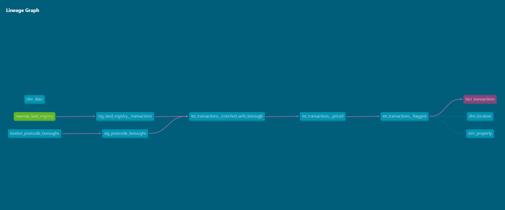
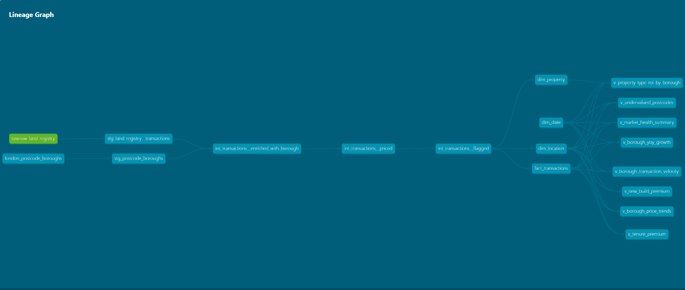

# London Housing Market Analytics Platform

> **Central Business Question:** *Where in London should a property investor deploy £500K over the next 12 months for the best risk-adjusted returns?*

A production-grade, end-to-end analytics pipeline built on **285,791 HM Land Registry transactions (2021–2024)** — ingested from raw CSV, staged through a cloud data lake, modelled in a 4-layer dbt architecture on Snowflake, and surfaced through an 8-KPI Tableau dashboard that directly answers investor decision-making questions.

---

## Dashboard Preview

| Executive Overview | Borough Comparison |
|---|---|
|  |  |

| Property Type ROI | Postcode Heatmap |
|---|---|
|  |  |

> *Dashboard built in Tableau. Full workbook: [`dashboard/London_Housing_Analytics.twbx`](dashboard/London_Housing_Analytics.twbx)*

---

## At a Glance

| | |
|---|---|
| **Source** | HM Land Registry Price Paid Data (Open Government Licence v3.0) |
| **Coverage** | London, 2021–2024 |
| **Volume** | 285,791 property transactions |
| **Pipeline** | Python → S3 → Snowflake → dbt (4 layers) → Tableau |
| **Models** | 13 dbt models (2 staging, 3 intermediate, 4 marts, 8 KPI views) |
| **Tests** | 70+ automated data quality checks |
| **Business KPIs** | 8 investor-facing analytical views |

---

## Business Questions Answered

The entire pipeline is built backwards from these 8 investor questions. Every model, join, and transformation exists to answer one or more of them.

| # | Business Question | dbt View | Dashboard Page |
|---|---|---|---|
| 1 | Which boroughs show consistent price growth vs. high volatility? | `v_borough_price_trends` | Price Trends |
| 2 | Which boroughs grew fastest year-on-year? Which are slowing? | `v_borough_yoy_growth` | Borough Comparison |
| 3 | Where can I exit quickly if needed? (market liquidity risk) | `v_borough_transaction_velocity` | Borough Comparison |
| 4 | What property type delivers the best 4-year ROI per borough? | `v_property_type_roi_by_borough` | Property Type ROI |
| 5 | Which specific postcodes offer the best entry value vs. borough average? | `v_undervalued_postcodes` | Postcode Heatmap |
| 6 | Is the new-build premium worth paying, per borough? | `v_new_build_premium` | Premiums & Tenure |
| 7 | What is the freehold price premium vs. leasehold, per borough? | `v_tenure_premium` | Premiums & Tenure |
| 8 | What are the top-line London market indicators and YoY trend? | `v_market_health_summary` | Executive Overview |

---

## Tech Stack

| Layer | Tool | Purpose |
|---|---|---|
| **Ingestion** | Python, pandas | Filter, clean, chunk-load 600MB source CSVs |
| **Storage (Bronze)** | AWS S3 | Raw CSV lake (immutable source-of-truth) |
| **Storage (Silver)** | AWS S3 + Parquet | Columnar format for efficient Snowflake COPY |
| **Warehouse** | Snowflake | Cloud analytics database, RAW schema |
| **Transformation** | dbt (dbt-snowflake) | 4-layer medallion: staging → intermediate → marts → KPIs |
| **Orchestration** | Manual / Phase 9 target | dbt run + test pipeline |
| **Visualisation** | Tableau | 4-page investor dashboard, `.twbx` packaged workbook |
| **Version Control** | Git / GitHub | Full lineage of every model change |

---

## Architecture

```
┌─────────────────────────────────────────────────────────────────────┐
│          HM LAND REGISTRY  (England & Wales, 2021–2024)            │
│                 Raw CSVs  ~600MB  ~2.4M rows total                  │
└──────────────────────────────┬──────────────────────────────────────┘
                               │  Python ETL (notebooks/01)
                               │  - Filter to London postcodes only
                               │  - pandas chunked read (memory-safe)
                               │  - Output: 285,791 rows
                               ▼
                    ┌──────────────────────┐
                    │   AWS S3 — Bronze    │   Raw CSV (immutable)
                    │   AWS S3 — Silver    │   Parquet (columnar)
                    └──────────┬───────────┘
                               │  Snowflake COPY INTO
                               ▼
              ┌─────────────────────────────────────┐
              │  Snowflake RAW.RAW_LAND_REGISTRY    │
              │  285,791 rows · untyped strings     │
              └──────────────────┬──────────────────┘
                                 │
                ┌────────────────┼────────────────┐
                │           dbt run               │
                ▼                ▼                ▼
         ┌──────────┐   ┌──────────────┐   ┌──────────┐
         │ STAGING  │   │ INTERMEDIATE │   │  MARTS   │
         │ (Views)  │──▶│   (Views)    │──▶│ (Tables) │
         └──────────┘   └──────────────┘   └──────────┘
              │                                   │
       Typed, renamed               Star schema: 1 fact + 3 dims
       Decoded codes                Surrogate keys, FK tests
       Derived fields               285,791 fact rows
                                         │
                                    ┌────▼─────┐
                                    │   KPIs   │
                                    │ (Views)  │
                                    └────┬─────┘
                                         │  8 investor views
                                    ┌────▼──────────────────┐
                                    │  Tableau Dashboard    │
                                    │  .twbx packaged       │
                                    │  4 dashboard pages    │
                                    └───────────────────────┘
```

---

## Data Pipeline: 4-Layer Medallion

### Layer 1 — Staging (Views)

**Input:** `RAW.RAW_LAND_REGISTRY` — 285,791 rows of raw, untyped Land Registry data.

**Purpose:** One-to-one cleaning. No business logic. No joins. Every downstream model builds on this foundation, so this layer earns its rigor.

| Model | Rows | Key Transformations |
|---|---|---|
| `stg_land_registry__transactions` | 285,791 | Cast `sale_date` string → DATE; decode 1-char property codes (D/S/T/F/O → Detached/Semi/Terraced/Flat/Other); decode tenure (F→Freehold, L→Leasehold); decode new-build flag (Y/N → Boolean); derive `sale_year`, `sale_quarter`, `sale_month`; extract `postcode_district` (e.g., SW1A) and `postcode_area` (e.g., SW); drop £0 prices, null postcodes, null dates |
| `stg_postcode_boroughs` | ~330 | Standardise casing and trim whitespace on hand-curated postcode→borough seed |

**Tests:** 14 — unique transaction_id, not_null on all key columns, accepted_values validating all decoded categorical fields (property type, tenure, PPD type).

---

### Layer 2 — Intermediate (Views)

**Input:** Staging views.

**Purpose:** Business logic enrichment. Joins, price classification, and analytical flags are computed once here and reused everywhere. This eliminates duplication across KPI views and BI tools.

**Dependency chain:** `enriched` → `priced` → `flagged`

| Model | Key Logic |
|---|---|
| `int_transactions__enriched_with_borough` | LEFT JOIN to postcode-borough seed on `postcode_district`. Unmatched postcodes → `'Unmatched'` (not NULL — keeps records queryable, enables coverage tracking). |
| `int_transactions__priced` | Add `price_band` (7 ordered tiers: Under £250K → £5M+, numbered to force correct BI sort order) and `market_segment` (4 tiers: Affordable / Mid-Market / Premium / Super-Prime). |
| `int_transactions__flagged` | Add 7 Boolean flags pre-computed for high-performance BI filtering: `is_central_london`, `is_prime_postcode_area`, `is_million_plus`, `is_super_prime`, `is_most_recent_year`, `is_flat`, `is_leasehold`. |

**Tests:** 8 — accepted_values on price_band/market_segment, uniqueness preservation through the chain.

---

### Layer 3 — Marts (Tables, Star Schema)

**Input:** `int_transactions__flagged` + `dbt_utils.date_spine`.

**Purpose:** Denormalized analytics tables optimized for repeated BI queries. Materialized as **tables** (not views) because Tableau queries the fact table on every user interaction — pre-computed tables eliminate re-scanning 285,791 rows on each click.

```
                        ┌──────────────┐
                        │   dim_date   │
                        │  1,461 rows  │
                        │  date_key PK │
                        └──────┬───────┘
                               │ date_key FK
                               │
┌──────────────┐   location_key FK   ┌────────────────────┐   property_key FK   ┌───────────────┐
│ dim_location │◄────────────────────│  fact_transactions  │────────────────────►│ dim_property  │
│  ~150 rows   │                     │   285,791 rows      │                     │   5–6 rows    │
│ location_key │                     │   transaction_key PK│                     │ property_key  │
│     PK       │                     │                     │                     │     PK        │
└──────────────┘                     │  MEASURES:          │                     └───────────────┘
                                     │  sale_price         │
                                     │  sale_price_M_plus  │
                                     │  transaction_count  │
                                     └────────────────────┘
```

| Dimension | Rows | Grain | Key Attributes |
|---|---|---|---|
| `dim_date` | 1,461 | One row per calendar day (2021–2024) | Year, quarter, month, week, day-of-week, is_weekend, period boundaries, year_quarter label |
| `dim_location` | ~150 | One row per unique (postcode_district, borough) combination | postcode_district, postcode_area, borough, is_central_london, london_region (8 values) |
| `dim_property` | 5–6 | One row per property type code | property_type_code, property_type_name, property_description, property_category (House/Apartment/Other) |

**Surrogate keys** are MD5 hashes (via `dbt_utils.generate_surrogate_key`) — deterministic, source-system-agnostic, and collision-free at this row count.

**Tests:** 35+ — unique/not_null on all primary keys, `relationships` tests enforcing full referential integrity (fact → every dimension, zero orphaned rows guaranteed).

---

### Layer 4 — KPI Views (Business Questions)

**Input:** `fact_transactions` joined to dimension tables.

**Purpose:** Translate the star schema into directly actionable investor intelligence. Each view answers one investor question and feeds one Tableau dashboard page.

**Materialisation:** Views (zero storage cost — always fresh on query).

#### `v_borough_price_trends`
Quarterly median and average prices per borough, with price volatility ratio (stddev ÷ mean). Identifies boroughs with consistent appreciation vs. erratic markets. Powers time-series trend charts.

#### `v_borough_yoy_growth`
Year-on-year price and volume growth per borough, computed with `LAG()` window functions. Produces `yoy_median_change_pct`, `yoy_avg_change_pct`, and `yoy_volume_change_pct` — the primary ranking signal for capital growth investors.

#### `v_borough_transaction_velocity`
Annual transaction counts per borough, ranked with `RANK()` and bucketed into 4 liquidity tiers with `NTILE(4)` (High / Moderate / Lower / Thin). Answers the exit-risk question: thin-market boroughs may appreciate but are harder to sell quickly.

#### `v_property_type_roi_by_borough`
Four-year price growth (2021 → 2024) segmented by property type per borough. Filters to combinations with ≥50 transactions to exclude statistical noise. Answers: *should I buy a flat or a house here, and which type appreciated more?*

#### `v_undervalued_postcodes`
Compares each postcode district's median price to its parent borough median (using 2023–2024 transactions only, post-COVID market normalisation). Buckets into five value positions: Significantly Undervalued (>25% below), Undervalued (10–25%), In Line, Premium, Significant Premium (>25% above). Minimum 30 transactions per postcode for statistical relevance. Enables micro-targeted entry at below-borough prices.

#### `v_new_build_premium`
Pivot analysis: median price for new builds vs. existing stock per borough, with minimum 50 transactions in each category. Outputs `premium_gbp` and `premium_pct`. Answers: *is the developer markup worth the warranty and depreciation risk?*

#### `v_tenure_premium`
Freehold vs. leasehold median price comparison per borough (≥50 transactions each). A high freehold premium signals strong ownership preference in that market — relevant to both entry price and future resale appeal.

#### `v_market_health_summary`
London-wide annual KPIs with YoY comparison via `LAG()`: total transactions, median price, total GBP volume, million-plus and super-prime deal counts, active boroughs, and YoY change percentages. Powers executive-level KPI cards and frames the macro context for all other analysis.

---

## dbt DAG (Model Lineage)

### Phase 5–7 Lineage (Staging → Marts)




### Full Lineage Including KPI Layer


---

## Data Quality

**70+ automated tests across all 4 layers** — dbt will not deploy a broken model.

| Test Type | What It Catches | Example |
|---|---|---|
| `unique` | Duplicate primary keys | Duplicate transaction_ids entering the fact table |
| `not_null` | Missing required values | Null borough after the LEFT JOIN |
| `accepted_values` | Out-of-range categoricals | An unexpected property type code in source data |
| `relationships` | Orphaned foreign keys | A fact row with a date_key not found in dim_date |

**Key design decisions for data integrity:**
- LEFT JOIN on postcode→borough mapping (never drop data; flag as `'Unmatched'`)
- Filters on £0 prices, null postcodes, null dates applied at staging (closest to source)
- `NTILE`, `LAG`, and window functions isolated to KPI views (no leaking into fact table)
- Minimum transaction thresholds (30–50) on aggregation views to prevent misleading single-sale statistics

---

## Project Structure

```
london-housing-analytics/
│
├── notebooks/
│   ├── 01_data_ingestion.ipynb          # Filter England & Wales → London, output Parquet
│   ├── 02_upload_raw_csv_to_s3.ipynb    # Bronze layer (S3 raw CSV)
│   └── 03_upload_parquet_to_s3.ipynb    # Silver layer (S3 Parquet)
│
├── dbt_london_housing/
│   ├── models/
│   │   ├── staging/
│   │   │   ├── stg_land_registry__transactions.sql
│   │   │   ├── stg_postcode_boroughs.sql
│   │   │   ├── sources.yml
│   │   │   └── stg_models.yml
│   │   ├── intermediate/
│   │   │   ├── int_transactions__enriched_with_borough.sql
│   │   │   ├── int_transactions__priced.sql
│   │   │   ├── int_transactions__flagged.sql
│   │   │   └── int_models.yml
│   │   └── marts/
│   │       ├── fact_transactions.sql
│   │       ├── dim_date.sql
│   │       ├── dim_location.sql
│   │       ├── dim_property.sql
│   │       ├── mart_models.yml
│   │       └── kpi/
│   │           ├── v_borough_price_trends.sql
│   │           ├── v_borough_yoy_growth.sql
│   │           ├── v_borough_transaction_velocity.sql
│   │           ├── v_property_type_roi_by_borough.sql
│   │           ├── v_undervalued_postcodes.sql
│   │           ├── v_new_build_premium.sql
│   │           ├── v_tenure_premium.sql
│   │           ├── v_market_health_summary.sql
│   │           └── kpi_models.yml
│   ├── seeds/
│   │   └── london_postcode_boroughs.csv # ~330 postcode → borough mappings
│   ├── macros/
│   │   └── generate_schema_name.sql     # Custom schema naming (prevents dev/prod collisions)
│   ├── dbt_project.yml
│   └── packages.yml                     # dbt-utils 1.3.0
│
├── dashboard/
│   ├── data/                            # CSV exports from Snowflake KPI views
│   ├── extracts/                        # Tableau .hyper extract files
│   ├── London_Housing_Analytics.twb
│   └── London_Housing_Analytics.twbx   # Packaged Tableau workbook
│
├── docs/
│   └── methodology.md                   # Transformation decisions and analytical rationale
│
├── screenshots/                         # Pipeline and dashboard screenshots
├── data/
│   ├── raw/                             # Original CSVs (gitignored)
│   └── processed/                       # Cleaned Parquet files (gitignored)
├── requirements.txt
├── .env.example                         # Snowflake credentials template
└── .gitignore
```

---

## Running the Pipeline

### Prerequisites

```bash
pip install -r requirements.txt
cp .env.example .env
# Fill in Snowflake credentials in .env
```

### Python ETL (Ingestion)

Run notebooks in order:
```
notebooks/01_data_ingestion.ipynb       # Filter to London, produce Parquet
notebooks/02_upload_raw_csv_to_s3.ipynb # Upload bronze layer to S3
notebooks/03_upload_parquet_to_s3.ipynb # Upload silver layer to S3
```

### dbt (Transformation)

```bash
cd dbt_london_housing

# Install dependencies
dbt deps

# Load seed file (postcode → borough mapping)
dbt seed

# Run all models (staging → intermediate → marts → KPIs)
dbt run

# Run all 70+ data quality tests
dbt test

# Run + test in one command
dbt build
```

### Snowflake Schema Layout

| dbt Layer | Snowflake Schema | Materialisation |
|---|---|---|
| Staging | `LONDON_HOUSING.STAGING` | Views |
| Intermediate | `LONDON_HOUSING.STAGING` | Views |
| Marts | `LONDON_HOUSING.MARTS` | Tables |
| KPI Views | `LONDON_HOUSING.MARTS` | Views |

---

## Pipeline Status

| Phase | Status | Description |
|---|---|---|
| Phase 1 | ✅ Done | Project foundation, documentation |
| Phase 2 | ✅ Done | Data ingestion — 285,791 London transactions (2021–2024) |
| Phase 3 | ✅ Done | Multi-layer S3 data lake + Snowflake RAW schema load |
| Phase 4 | ✅ Done | dbt project setup, sources, first passing tests |
| Phase 5 | ✅ Done | Staging layer — code mapping, postcode-borough seed, 14 tests |
| Phase 6 | ✅ Done | Intermediate layer — borough enrichment, price bands, analytical flags |
| Phase 7 | ✅ Done | Mart layer — star schema (1 fact + 3 dimensions), referential integrity tests |
| Phase 8 | ✅ Done | KPI layer — 8 business-question views (YoY growth, liquidity, undervalued postcodes, premiums) |
| Phase 9 | 🔄 In progress | Tableau dashboard — 4-page investor workbook |

---

## Known Limitations

| Limitation | Detail |
|---|---|
| **Postcode coverage** | Hand-curated mapping covers ~95% of London transactions. Edge postcodes near the M25 boundary may be marked `'Unmatched'`. Production use would use the ONS Postcode Directory. |
| **2024 data completeness** | HM Land Registry has a ~2-month registration lag. Late-2024 transactions may be under-represented. |
| **Nominal prices** | No inflation adjustment applied. YoY % comparisons are in nominal GBP terms. |
| **Share transfers excluded** | The source data excludes property purchases via share/company transfer (PPD type B filtered at source). |
| **No mortgage data** | Analysis is based on sale price only. Rental yield and leverage analysis would require external data sources. |

---

## Data Source

**HM Land Registry Price Paid Data**
[gov.uk/government/statistical-data-sets/price-paid-data-downloads](https://www.gov.uk/government/statistical-data-sets/price-paid-data-downloads)

Licensed under the Open Government Licence v3.0. Contains HM Land Registry data © Crown copyright and database right 2024.

---

## Methodology

See [`docs/methodology.md`](docs/methodology.md) for detailed rationale behind:
- London filtering criteria
- Price band and market segment definitions
- Central London borough classification
- Postcode-to-borough join strategy (LEFT JOIN rationale)
- Star schema design choices (degenerate dimensions, surrogate keys)
- KPI view filtering thresholds (minimum transaction counts)
